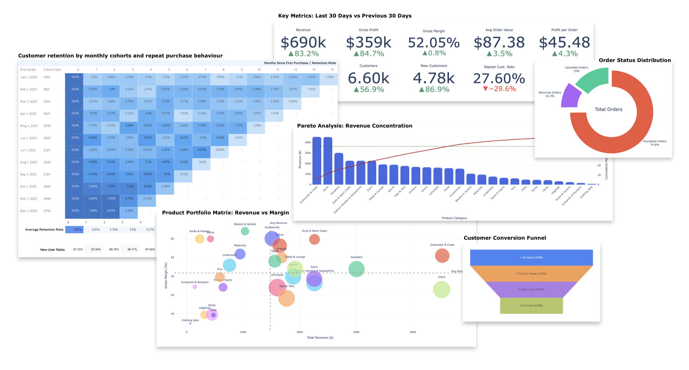

# E-commerce Business Analytics Dashboard

**SQL • BigQuery • Looker Studio • Python (Colab)**

This project analyzes an e-commerce business using the public dataset  
`bigquery-public-data.thelook_ecommerce`.

The goal of the project is to build a **business-oriented analytics dashboard** and validate the key metrics and insights using Python.

The analysis focuses on four main areas of e-commerce performance:

- Business performance overview
- Customer retention and acquisition
- Product and category performance
- Customer behavior and conversion funnel

---

# Visualizations Preview



This project includes **two dashboard implementations**:

### Looker Studio Dashboard
- Available in `/dashboard/thelook_ecommerce_looker_studio.pdf`
- Interactive version available upon request

### Power BI Dashboard
- Available in `/dashboard/thelook_ecommerce_power_bi.pdf`
- Full `.pbix` file available upon request

Both dashboards are based on the same underlying data model and business logic, but demonstrate different BI tools and visualization approaches.

# Multi-Tool BI Approach

The same business problem is implemented in both Looker Studio and Power BI.

This highlights:
- ability to adapt analytics across different BI tools
- understanding of differences in data modeling and visualization layers
- flexibility in working with various stakeholder environments

---

# Data Source

This analysis uses the public BigQuery dataset:

`bigquery-public-data.thelook_ecommerce`

Main tables used in the project:

- **orders** — order-level information (customers, dates, shipment, order status)
- **order_items** — item-level revenue data
- **products** — product and category attributes
- **inventory_items** — product cost data used for profit and margin calculations
- **events** — website behavior events used for conversion funnel analysis

---

# Important Note on the Dataset

The `thelook_ecommerce` dataset is **synthetic**, meaning it was generated to simulate realistic e-commerce data rather than representing a real company.

As a result, some metrics and distributions may appear unusual compared to real-world business data.

The purpose of this project is therefore to demonstrate:

- analytical reasoning
- SQL data modeling
- dashboard design
- business metric interpretation

---

# Analytical Scope

The analysis is structured around four main business questions.

## 1. Business Performance Overview

Evaluate the overall performance of the business using key metrics such as:

- Revenue
- Gross Profit
- Gross Margin
- Average Order Value (AOV)
- Orders
- Customers
- New Customers
- Repeat Customer Rate
- Items Sold

The KPI cards compare the **last 30 days with the previous 30-day period**.

Time-series charts show the full annual trend for revenue and orders, alongside the corresponding trend from the previous year to highlight growth patterns and seasonality.

---

## 2. Customer Retention

Customer retention is analyzed using **cohort analysis**.

Key visualizations:

- Cohort retention heatmap
- Average retention
- New customer acquisition trend

This allows evaluation of:

- how well customer cohorts return over time
- how acquisition contributes to overall growth
- how retention and acquisition interact.

---

## 3. Product Performance

This section evaluates which product categories contribute most to revenue and profitability.

Questions addressed:

- Which categories drive the business?
- Which categories generate the highest margins?
- Is revenue concentrated in a small portion of the assortment?

Visualizations include:

- Top categories by revenue (colored by margin)
- Product portfolio matrix (Revenue vs Margin)
- Pareto analysis of revenue concentration

During initial exploration it became clear that product-level analysis is limited due to the **very fragmented assortment** and inconsistent product-category relationships in the dataset.

Therefore the analysis focuses primarily on **category-level performance**, which provides a more stable and interpretable view of the business.

---

## 4. Customer Behavior

Customer behavior is analyzed using website event data.

Visualizations include:

- Order status distribution
- Conversion funnel
- Purchase conversion rate trend

These analyses help evaluate:

- how users progress through the purchase funnel
- where conversion drop-offs occur
- how conversion rates evolve over time.

---

# Tools Used

**Data Extraction**
- Google BigQuery
- SQL

**Dashboards**
- Looker Studio
- Power BI

**Analysis & Visualization**
- Python
- Pandas
- Plotly
- Google Colab

---

# Project Structure
```text
ecommerce-analytics-project
│
├── sql/                             # Optimized BigQuery SQL scripts
│   ├── 01_cohort_retention.sql       # User loyalty and LTV logic
│   ├── 02_orders_enriched.sql        # Financial KPIs and MoM growth
│   ├── 03_product_analytics.sql      # Pareto and Margin analysis
│   ├── 04_events_analytics.sql       # Funnel and user behavior logs
│   ├── 05_order_status_analytics.sql # Operational & return rate audits
│   └── 06_conversion_over_time.sql   # Time-series for CR trends
│
├── notebooks/                       # Data Science & Visualization
│   └── thelook_ecommerce.ipynb      # Main Colab/Jupyter analysis
│
├── dashboard/                       # BI dashboards (Looker Studio & Power BI)
│   ├── thelook_ecommerce_looker_studio.pdf
│   └── thelook_ecommerce_power_bi.pdf
│
├── assets/                          # Media for README
│   └── preview.png                  # Dashboard screenshot
│
├── README.md                        # Documentation
└── requirements.txt                 # Python dependencies
